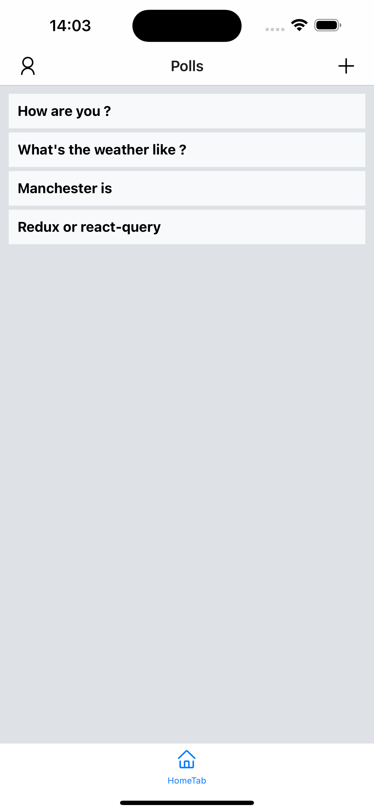

# Voting App

This is a simple voting app that allows users to vote on a poll and see the results in real time. The app is built using React Native and Supabase.

## Features

- Authentication with email and password using Supabase
- Create a poll with multiple options if you are authenticated
- Vote on a poll and see the results in real time
- View the results of a poll in real time

## How to Install

1. Clone the repository
2. Run `yarn install` to install the dependencies
3. Create a `.env` file in the root of the project and add the following environment variables:

```
EXPO_PUBLIC_SUPABASE_URL=your_supabase_url
EXPO_PUBLIC_SUPABASE_ANON_KEY=your_supabase_anon_key
```

4. Run `yarn start` to start the Expo development server

## Screenshots


